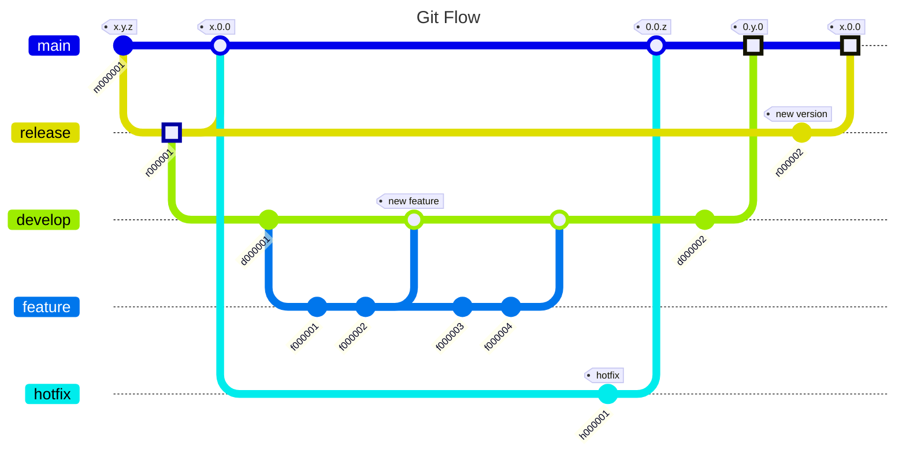

## Flow

```mermaid
---
title: Git Flow
---
gitGraph
    %% tag: "TAG"
    %% type: NORMAL | REVERSE | HIGHLIGHT
    %% commit id:"id" type: NORMAL

    %% production branch: MASTER | main | trunk
    
    %% checkout main
    commit id:"m000001" tag: "x.y.z"
    branch release
    commit type:HIGHLIGHT id:"r000001"
    checkout main
    merge release tag: "x.0.0"
    checkout release
    %% commit
    branch develop
    commit id:"d000001"
    branch feature
    commit id:"f000001"
    commit id:"f000002"
    checkout develop
    merge feature tag:"new feature"
    checkout feature
    commit id:"f000003"
    commit id:"f000004"
    checkout develop
    merge feature

    checkout main
    branch hotfix order:0
    commit tag: "hotfix" id:"h000001"
    checkout main
    merge hotfix tag: "0.0.z"

    checkout develop
    commit id:"d000002"
    checkout main
    merge develop tag: "0.y.0" type:HIGHLIGHT
    checkout release
    commit id:"r000002" tag:"new version"
    checkout main
    merge release tag: "x.0.0" type:HIGHLIGHT
```
